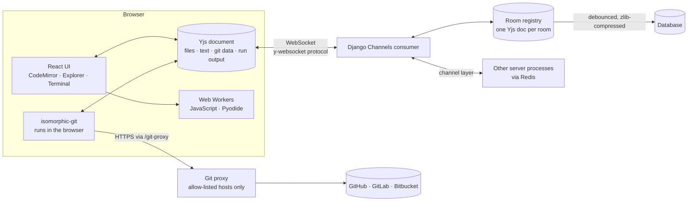
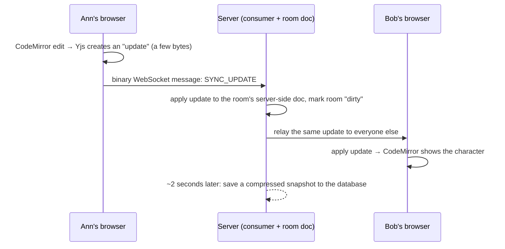
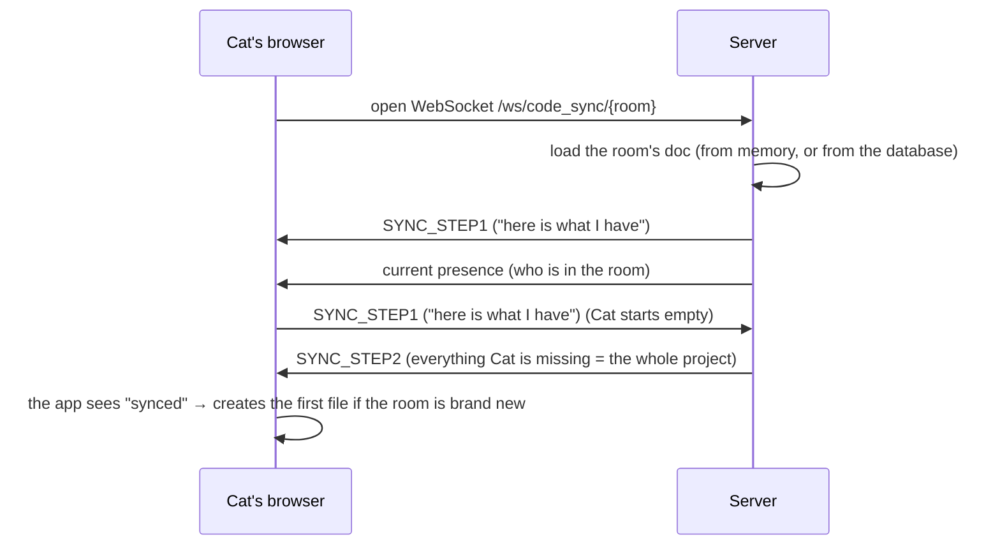

# CodeWithFriend — the complete project guide

This document explains **everything** about CodeWithFriend: what it does, how it is built, the concepts behind each part, the decisions that were made (and the alternatives that were rejected), the bugs that were found along the way, and what to say about all of it in an interview.

It is written to be read top to bottom the first time, then used as a reference. If you only want to run the project, read the [README](README.md) instead.

---

## Table of contents

1. [What the project is](#1-what-the-project-is)
2. [How the project evolved](#2-how-the-project-evolved)
3. [The big picture](#3-the-big-picture)
4. [Concept primer: the ideas you need](#4-concept-primer-the-ideas-you-need)
5. [The backend in detail](#5-the-backend-in-detail)
6. [The shared document: how data is modelled](#6-the-shared-document-how-data-is-modelled)
7. [The frontend in detail](#7-the-frontend-in-detail)
8. [Files, folders and importing](#8-files-folders-and-importing)
9. [Running code safely](#9-running-code-safely)
10. [Previews](#10-previews)
11. [The terminal](#11-the-terminal)
12. [Git in the browser](#12-git-in-the-browser)
13. [The git proxy](#13-the-git-proxy)
14. [Compression and performance](#14-compression-and-performance)
15. [Security model](#15-security-model)
16. [UX and design decisions](#16-ux-and-design-decisions)
17. [Testing](#17-testing)
18. [Configuration and deployment](#18-configuration-and-deployment)
19. [Decision log](#19-decision-log)
20. [Bugs found and lessons learned](#20-bugs-found-and-lessons-learned)
21. [Scaling: what works and what doesn't](#21-scaling-what-works-and-what-doesnt)
22. [Limitations and roadmap](#22-limitations-and-roadmap)
23. [Interview preparation](#23-interview-preparation)
24. [Glossary](#24-glossary)
25. [File-by-file reference](#25-file-by-file-reference)
26. [A suggested reading order for the code](#26-a-suggested-reading-order-for-the-code)

---

## 1. What the project is

**CodeWithFriend** is a web app where several people open the same "room" and work on the same project at the same time.

- Everyone sees the same files, folders and code, and sees each other's **cursors** as they type.
- Anyone can **run** Python or JavaScript and everyone sees the output.
- HTML and Markdown get a **live preview**.
- A **terminal** lets you use shell commands and **git**. The git history is shared too: a commit made by one person is visible to everyone in the room.
- There are **no accounts**. You make up a name, create or join a room, and share the link.

### Who it is for

Pair programming, technical interviews, teaching a class, or quickly hacking something with a friend, where setting up a shared workspace would otherwise take longer than the task itself.

### The three ideas that shape every decision

1. **Convergence without coordination.** People type at the same time, on flaky networks. The system must always end up with everyone seeing the identical text, with nobody's edit lost, and without a central "referee" deciding the order. (This is why it uses a *CRDT*.)
2. **Never run strangers' code on the server.** Anyone with a link can type anything. So code execution, git and the terminal all run **inside each user's browser**, and the server only relays data. (This is why there is a Web Worker sandbox and an in-browser git.)
3. **The whole project is one document.** Files, folders, file contents, git's internal data and run output all live in a single shared data structure. Once syncing that structure works, every feature gets sync, persistence and presence "for free".

---

## 2. How the project evolved

Understanding the history explains why the design looks the way it does.

| Stage | What existed | What was wrong / why it changed |
|---|---|---|
| **v1** | A React editor and a Django WebSocket relay. Every keystroke was sent as `{from, to, insert}` (position-based edits) and rebroadcast to others. Who-is-online was stored in a database table and polled by every client once per second over HTTP. | Concurrent edits **diverge**: positions are relative to a document the receiver no longer has, so two people typing at once end up with different text. A late joiner got an empty editor. The polling didn't scale. Four WebSocket connections were opened per user. The secret key and database were committed. |
| **v2 — Yjs** | The relay was replaced with the **Yjs** CRDT. The server became a y-websocket-protocol relay that keeps a copy of each room's document. Presence moved into Yjs "awareness". The REST endpoints and the polling were deleted. | — (this is the foundation everything else builds on) |
| **v3 — run and preview** | Language switcher; running JavaScript and Python in Web Workers; shared run output; HTML and Markdown previews; a redesigned UI and a phone layout. | A single file isn't a project. |
| **v4 — files and folders** | A shared file tree, tabs, an explorer with drag-and-drop, importing a folder from your computer, multi-file `import`/`require`, HTML that pulls in its CSS and JS. | Saving and syncing everything wasn't free: needed size limits and compression. |
| **v5 — efficiency** | Switched the server from Daphne to Uvicorn to get WebSocket compression; zlib-compressed saved rooms; higher import limits. | — |
| **v6 — terminal and git** | An in-browser terminal, a small shell, and real git (isomorphic-git) over a filesystem that maps onto the shared project. A backend proxy for GitHub clone/push. | — |
| **v7 — docs** | An in-app guide and the documentation you are reading. | — |

The honest summary: **the first version was a demo; the rewrite to a CRDT is what made it a real system.** Everything after that is feature work on top of a sound core.

---

## 3. The big picture

### Components



### What lives where

| Piece | Runs in | Why there |
|---|---|---|
| Editing, file tree, terminal, git, code execution, previews | The **browser** | Safe (no strangers' code on your server), fast, free to scale |
| WebSocket relay | The **server** | Browsers can't talk to each other directly; someone has to forward messages |
| A server-side copy of each room's document | The **server** | A late joiner needs the state even if everyone else has left |
| Saving rooms | The **server** (database) | So rooms outlive their users |
| Git proxy | The **server** | Browsers are blocked by CORS from calling GitHub directly |

### Three request flows

**A. Someone types a character**



**B. Someone joins a room**



**C. Someone clicks Run on a Python file**

1. The browser gathers every file's text into a `{path: text}` map.
2. It posts the map and the entry file to a Web Worker that runs Pyodide.
3. The worker mirrors the files into Pyodide's in-memory filesystem and executes the entry file.
4. When it finishes, the browser writes `{status:'done', stdout, stderr, ms}` into a shared `run` map in the document.
5. Everyone's Output panel updates, because the `run` map is part of the synced document.

---

## 4. Concept primer: the ideas you need

If you know these, the rest of the document will feel obvious.

### 4.1 Why "just send the edit" doesn't work

Imagine the text is `HELLO`. Ann deletes the first letter. At the same moment Bob inserts `!` at position 5 (the end).

- Ann's browser: `HELLO` → delete index 0 → `ELLO`.
- Bob's browser: `HELLO` → insert `!` at 5 → `HELLO!`.

Now each sends its edit to the other.

- Ann receives "insert `!` at 5" and applies it to `ELLO`. Position 5 is past the end, so the best she can do is `ELLO!` — which is *correct by luck*. Change the example slightly (insert in the middle) and she'd put the character in the wrong place.
- Bob receives "delete index 0" and gets `ELLO!`.

In real life with many concurrent edits, positions drift, and the two documents **diverge permanently**. This is exactly what version 1 did.

There are two well-known families of solutions:

| Approach | Idea | Used by | Catch |
|---|---|---|---|
| **Operational Transformation (OT)** | A central server *transforms* each incoming edit against the edits that happened concurrently, so positions are corrected. | Google Docs | Needs a central authority and very subtle transform functions; hard to get right; hard to do offline. |
| **CRDT** (Conflict-free Replicated Data Type) | Design the data structure so that merging is **always safe**: any order, any number of times, gives the same result. | Yjs, Automerge, many modern editors | Documents carry extra metadata; need garbage collection. |

CodeWithFriend uses a CRDT (**Yjs**).

### 4.2 How a CRDT text works (the intuition)

Instead of identifying characters by *position* ("the 5th letter"), a CRDT gives **every character a permanent unique ID** (roughly "client 1234, clock 17"). An insert says *"put this new character after the character with ID X"* rather than *"at index 5"*. IDs never change, so the instruction means the same thing on every machine, no matter what else was inserted in the meantime.

A delete doesn't remove the character; it marks it as deleted (a **tombstone**), so later inserts that refer to it still make sense. (Yjs garbage-collects tombstones where it safely can.)

Because of this, merging has three properties:

- **Commutative** — order of arrival doesn't matter.
- **Associative** — grouping doesn't matter.
- **Idempotent** — applying the same update twice does nothing.

That's why the server can relay updates in any order, why duplicates are harmless, why you can edit offline and merge later, and why *no central referee is needed*.

### 4.3 Yjs vocabulary

| Term | Meaning |
|---|---|
| **Doc** (`Y.Doc`) | One shared document. Everyone in a room has a copy. |
| **Shared types** | Data structures inside a Doc that sync: `Y.Text`, `Y.Map`, `Y.Array`. A Y.Map can hold other Y.Maps and Y.Texts — nesting is allowed. |
| **Update** | A small binary blob describing "what changed". Applying it to any copy of the doc brings that copy up to date. |
| **State vector** | A compact summary of "which updates from each client I already have". Used to ask *"what am I missing?"* |
| **Sync protocol** | `STEP1`: "here's my state vector". `STEP2`: "here's everything you're missing". `UPDATE`: a live incremental change. |
| **Awareness** | A *separate, temporary* channel for presence — names, colours, cursors. It is **not stored in the document** and times out if a client disappears. |
| **Relative position** | A cursor position expressed as "just after character ID X" instead of "index 17", so it stays attached to the right character as others type. |

The wire format is the **y-websocket protocol**: every binary message starts with a type byte — `0` = sync (followed by a sub-type `0/1/2` = step1/step2/update) and `1` = awareness.

### 4.4 WebSockets, ASGI and Django Channels

- **HTTP** is request → response. **WebSocket** is a long-lived two-way connection: either side can send at any time. Essential for live collaboration.
- **WSGI** (classic Django) handles one request at a time per worker and can't hold open connections cheaply. **ASGI** is the async successor and can hold thousands of connections. **Django Channels** adds WebSocket support to Django on top of ASGI.
- A **consumer** is Channels' class for one WebSocket connection (`connect`, `receive`, `disconnect`) — think of it as a mini-view that lives as long as the socket.
- A **channel layer** lets consumers talk to each other through named **groups** ("send this to everyone in group `room.abc`"). With the **in-memory** layer this only works inside one server process. With **Redis**, it works across many processes and machines.
- **Uvicorn** is the ASGI *server* that runs the app (like Gunicorn for WSGI).

### 4.5 Browser sandboxing

A **Web Worker** is a separate thread with no access to the page's DOM, cookies or `localStorage`. Running untrusted code in a worker (with network APIs removed) is far safer than running it on the page — and *much* safer than running it on your server. An `<iframe sandbox>` similarly confines a page to an "opaque origin".

### 4.6 CORS in one paragraph

Browsers block a page on site A from reading responses from site B **unless site B opts in** with `Access-Control-Allow-*` headers (CORS). GitHub doesn't opt in for arbitrary websites, so a browser can't talk to GitHub directly. A **proxy** on your own server (which *does* send the right headers) solves that — but a proxy is also dangerous if it will fetch *anything*, so ours is locked down (see [section 13](#13-the-git-proxy)).

### 4.7 Git in 90 seconds (needed for section 12)

Git stores a project as a graph of objects inside a `.git` folder:

- **blob** — the contents of one file. **tree** — a folder (names → blobs/trees). **commit** — a snapshot (points to a tree + parent commit(s) + author + message).
- **refs** — names for commits: branches (`refs/heads/main`), tags, remotes. **HEAD** says which branch you're on.
- **working tree** — your actual files. **index (staging area)** — the next commit you're preparing.

`git add` copies a file into the index. `git commit` turns the index into a commit. `git status` compares **three** things: HEAD (last commit), the index, and the working tree.

---

## 5. The backend in detail

The backend is small on purpose (~850 lines including migrations and tests). Its jobs: **relay** messages, **remember** each room, **save** it, and **proxy** git.

### 5.1 Routing and the entry point — `codeSync/asgi.py`, `main/routing.py`

```text
ProtocolTypeRouter
 ├─ "http"      → Django (admin, /health, /git-proxy/…)
 └─ "websocket" → OriginValidator → URLRouter → CodeSyncConsumer
                  route: ws/code_sync/<room>      (room = 1–64 chars of A–Z a–z 0–9 _ -)
```

- The room name is validated **in the URL regex**, so a malformed name never reaches the consumer.
- `OriginValidator` checks the `Origin` header against `WS_ALLOWED_ORIGINS` so other websites can't open sockets to your server from a user's browser.
- y-websocket appends the room name *without* a trailing slash, hence the optional `/?` in the regex.

### 5.2 The consumer — `main/consumers.py`

`CodeSyncConsumer` speaks the y-websocket protocol. Pseudocode:

```text
connect():
    room = rooms.join(name, my_channel)            # load/get the room's server-side doc
    group_add("room.<name>", my_channel)           # so relayed messages reach me
    accept()
    send(SYNC_STEP1 of the server's doc)           # "tell me what you have that I lack"
    send(snapshot of current presence)             # who is here right now

receive(bytes):
    if empty or > 2 MB:        close(1009)         # too big
    if SYNC message:
        reply = handle_sync_message(...)           # applies updates / answers step1
        if reply: send(reply) to just this client
        if it was step2 or update:
            room.mark_dirty()                      # schedule a save
            relay to everyone else in the group
    if AWARENESS message:
        remember it (so newcomers can be told), relay to others
    on any malformed input: close(1003)

disconnect():
    group_discard
    broadcast "removed" for this client's presence entries
    rooms.leave(...)                               # last one out saves & frees the room
```

**Key design points**

- **The server applies every update to its own copy** of the document. That is what lets a *late joiner receive the full state even when nobody else is online*. (A pure relay would have no state of its own.)
- **A custom consumer instead of the library's `YjsConsumer`.** The library's version creates a separate document per connection, echoes updates back to the sender, and keeps nothing once the room empties. Ours shares one document per room, skips the sender, and persists. (See the [decision log](#19-decision-log).)
- **Relay vs. reply.** `STEP1` is a private question to the server and is *not* relayed. `STEP2` and `UPDATE` carry data everyone needs, so they are.
- **Cross-process mirroring.** When the channel layer delivers a message from a *different* server process, the consumer also applies it to this process's copy of the room (`relay()` in the consumer). That keeps each process's copy current. Updates are idempotent, so applying one twice is harmless.
- **Safety.** Messages over 2 MB close the socket with code `1009`; malformed messages close with `1003`. Older `pycrdt` versions report corrupt data as a Rust *panic* (a `BaseException`, not an `Exception`), so the handler catches `BaseException` but re-raises task cancellation.

### 5.3 The room registry — `main/rooms.py`

One `Room` object per active room, **per server process**:

| Field | Purpose |
|---|---|
| `doc` | The server-side Yjs document |
| `channels` | Which local connections are in the room (the reference count) |
| `peers`, `peer_owner` | Remembered presence entries, so newcomers can be shown who is already here |
| `dirty`, `_save_task` | Whether there are unsaved changes, and the pending delayed save |

**Lifecycle**

- `join(name, channel)`: under a **lock**, get the room, or load it from the database (decompressing) and create it. Add the channel.
- `mark_dirty()`: schedule a save **2 seconds** later (`SAVE_DELAY`). Many keystrokes inside that window cause only one write — *debouncing*.
- `leave(room, channel)`: remove the channel. If it was the **last one**, cancel the pending save, **save immediately**, and drop the room from memory.

**Subtle but important:** `leave` does its final save **while holding the same lock** that `join` uses. Otherwise this could happen: the last user leaves → room dropped from memory but not yet saved → a new user joins and loads the *old* snapshot from the database → the unsaved edits are lost. Holding the lock closes that race.

Also, the lock is created **lazily** (on first use), not at import time. On Python 3.9, an `asyncio.Lock()` created at import binds to whatever event loop exists *then*, which may not be the one the server runs — raising "attached to a different loop". (See [bugs](#20-bugs-found-and-lessons-learned).)

### 5.4 Presence plumbing — `main/awareness.py`

Awareness messages are small binary records: a count, then for each client `(clientID, clock, JSON state)`. The server never *interprets* the state (names, colours, cursors); it only needs the IDs and clocks, for two jobs:

1. **Welcome newcomers.** The room remembers the latest entry per client and replays it to anyone who joins, so they see existing people immediately instead of waiting up to ~15 seconds for the next heartbeat.
2. **Clean up on disconnect.** When a socket drops (tab closed, crash), the server broadcasts a *removal* for that client's entries: the same ID with `clock + 1` and the state `null`. Clients accept a higher clock, so the person vanishes at once instead of lingering for 30 seconds until their entry times out.

### 5.5 Persistence — `main/models.py`, migrations

```python
class RoomDocument(models.Model):
    room       = CharField(max_length=64, unique=True)
    state      = BinaryField()        # zlib-compressed Yjs update
    compressed = BooleanField(default=False)
    updated_at = DateTimeField(auto_now=True)
```

- **What is saved:** the *entire* document as one Yjs update (`doc.get_update()`), not a log of changes. Loading is just `apply_update`. Simple and robust, at the cost of rewriting the whole blob on each save (see [scaling](#21-scaling-what-works-and-what-doesnt)).
- **Compression:** `zlib.compress(state, 6)`. A 400 KB test room was stored in ~65 KB (~16%).
- **The `compressed` flag** exists because rooms saved *before* compression was added hold raw bytes. A boolean column (default `False`, added in migration `0004`) lets the loader tell old from new unambiguously. (Guessing from the bytes would be unreliable: a raw Yjs update could happen to start with the same byte as a zlib header.)
- **Migration history:** `0001`–`0002` are the original v1 table (since removed from the code), `0003` creates `RoomDocument` and deletes the old table, `0004` adds `compressed`.

### 5.6 The health check, admin and settings

- `/health` returns `ok` — used by hosting platforms.
- `RoomDocument` is registered in the Django admin.
- `settings.py` reads configuration from environment variables (secret key, debug, allowed hosts, WebSocket origins, Redis URL, database path). With no `REDIS_URL` it falls back to the in-memory channel layer so local development needs no Redis.

---

## 6. The shared document: how data is modelled

Everything is stored in **one Yjs document per room**. Its top-level layout:

```text
Y.Doc
 ├─ files   : Y.Map<id → Y.Map>      the project: files and folders
 │    └─ each entry: { name, parent: id|null, kind: 'file'|'folder', lang?, text?: Y.Text }
 ├─ gitfs   : Y.Map<path → bytes>    the git repository's internal files (see section 12)
 ├─ run     : Y.Map                   the latest run: { status, by, lang, stdout, stderr, ms, … }
 ├─ meta    : Y.Map                   { initialized: true }  (+ legacy language)
 └─ codemirror : Y.Text               legacy single-file text (kept only to migrate old rooms)
```

### 6.1 The file tree

**Entries are keyed by a short random id, and refer to their parent by id** (not by path). That single decision makes several things trivial and robust:

- **Rename a folder** = change one `name` field. Every path under it updates automatically, because paths are *computed* (`pathsById`) by walking parent links.
- **Move a file** = change one `parent` field.
- **Deleting** = remove entries (a folder removes its descendants in one transaction).

If paths were stored as strings (`"src/app.py"`), renaming a folder would mean rewriting every descendant — many writes that could interleave badly with other people's edits.

**Concurrency edge cases** (people act at the same time) and how they're handled:

| Situation | Handling |
|---|---|
| Ann deletes a folder while Bob creates a file in it | The file's parent no longer exists → shown at the **root** instead of vanishing. |
| Ann moves folder X into Y while Bob moves Y into X (a **cycle**) | The tree builder detects nodes it can't reach from the root and **hoists them to the root**. |
| Two people create the same name in one folder | Names are validated at creation (case-insensitive); the later one gets an error. A rare true race could produce two same-named entries; they're still distinct ids so nothing is lost. |

### 6.2 The first file and old rooms — `initProject`

When someone's client finishes its first sync, it calls `initProject`:

- If the room has never been initialised (`meta.initialized` is unset) **and** has no files, it creates a single file with the **fixed id `main`**. If the room was created before multi-file support, that file is filled with the old single-file text and named after the old language (`main.py`, etc.).
- **Fixed id on purpose:** if two people join a brand-new room in the same instant and *both* create the first file, both write the same key `main`; the CRDT keeps exactly one. (Random ids would produce two files.)
- **The `initialized` flag:** without it, if everyone deleted all files and a new person joined, `main.js` would reappear. With it, an emptied project stays empty.
- It runs only **after the `sync` event**, so a client never creates `main` before it has seen the server's existing state.

### 6.3 Why `observeDeep` is filtered

The UI needs to re-render the tree when files are added/renamed/deleted — but **not** on every keystroke, and every keystroke is a change somewhere inside `files` (a nested `Y.Text`). The hook subscribes with `observeDeep` and **ignores events whose target is a `Y.Text`**, so only *structural* changes rebuild the tree.

### 6.4 Awareness fields

Each browser publishes, via awareness (temporary, not stored):

| Field | Used for |
|---|---|
| `user: { name, color, colorLight }` | Avatars, remote cursor labels, join/leave toasts |
| `file` | Which file the person has open → the coloured dot beside files in the explorer |
| `cursor` (set by `y-codemirror.next`) | The remote cursor/selection, as a *relative position* |

Colour is derived from the name (a small hash into a palette), so someone has the same colour in their avatar and cursor in everyone's view, with no coordination.

---

## 7. The frontend in detail

React 18, bundled with Create React App. The state of a room flows through one hook.

### 7.1 `useCollab` — the heart of the frontend (`src/hooks/useCollab.js`)

`useCollab(roomId, username)`:

1. Creates a `Y.Doc` and a `WebsocketProvider` (from `y-websocket`) pointing at `<WS_URL>/<roomId>`.
2. Publishes the local awareness state (name, colour).
3. On the provider's **`sync`** event: runs `initProject`, marks the room `ready`, and starts allowing "X joined" toasts one second later (so you aren't spammed with toasts for people who were already there).
4. Subscribes to structural changes (→ `nodes`), the `run` map (→ `run`), and awareness (→ `users`).
5. Returns `{ files, gitfs, awareness, users, nodes, ready, status, run, publishRun }`.
6. On cleanup, **destroys** the provider and doc.

**React StrictMode** (development) mounts, unmounts and re-mounts effects to flush out bugs; the cleanup function above makes that safe.

**One y-websocket detail worth knowing:** y-websocket also syncs between **tabs of the same browser** through a `BroadcastChannel`, without involving the server. That's great for users but can fool a test: two tabs "syncing" doesn't prove the server works. (It caught out an early test run.)

### 7.2 `EditorPage` — orchestration

The room page ties everything together:

- Which file is **active** and which are **open as tabs** (local to each person, not shared).
- Keeps tabs valid when others delete or rename files (an effect reconciles `openIds`/`activeId` against the current tree).
- Computes the active file's **language** (from the extension, or a per-file override stored in the document).
- Runs code (`handleRun`), copies the invite link, opens files by path (for the terminal's `open` command).
- Renders the **top bar**, **Explorer**, **Tabs**, **Editor**, and the **Dock** (bottom panel with Output/Preview and Terminal tabs).

### 7.3 The editor — `src/pages/Editor.js`

Built on **CodeMirror 6**:

- `yCollab(ytext, awareness)` (from `y-codemirror.next`) binds the editor to the file's `Y.Text`: local edits become Yjs updates; remote updates become editor changes; remote cursors are drawn.
- **Undo is Yjs-aware:** the Yjs undo keymap is listed *before* CodeMirror's default history bindings, so ⌘Z undoes only *your own* edits, not other people's.
- **Language support is a `Compartment`:** a slot you can reconfigure at runtime. Changing the language swaps the syntax extension *without recreating the editor or touching the text*. Language packages are **lazy-loaded** (`import()`), so the first screen stays small.
- The editor is recreated per file (`[ytext, awareness]` dependencies) — simple and correct, at the cost of losing scroll position when switching tabs.
- `Mod-Enter` (⌘/Ctrl+Enter) runs the code.

### 7.4 The Dock — `src/components/OutputPanel.js`

A bottom panel with a draggable top edge and **tabs**: *Output* (or *Live preview* / *Markdown preview*) and *Terminal*.

- Both panes stay **mounted** and the inactive one is hidden (`hidden` attribute). That's deliberate: if the Terminal were unmounted when you look at Output, you'd lose your session. (xterm instances are expensive and stateful.)
- Preview modes ask for a taller panel automatically (readers need room).
- The dock height is shared state so the terminal can re-fit itself when it changes.

### 7.5 The Output panel's states

`ConsoleBody` shows an empty-state hint, then the run result. The header chips (`Running…`, `Finished`, `Timed out`, "who ran it · how long") are computed from the shared `run` record, so *everyone* sees "Ann is running…" while Ann's code executes.

### 7.6 The explorer's data helpers — `src/utils/fs.js`

Pure functions over the `files` map: `readNodes`, `buildTree` (sorting + the orphan/cycle handling), `pathsById`, `createNode`, `renameNode`, `moveNode`, `deleteNode`, `validateName`, `resolvePath`, `initProject`. They enforce the limits (**100 entries**, **6 levels deep**, names ≤ 64 chars, no `/`).

### 7.7 Phone layout

- The top bar becomes **two rows**: room + people + leave, then language + a full-width **Run** button (big tap targets).
- The explorer becomes a **slide-over drawer** with a backdrop.
- Inputs use 16px text (otherwise iOS zooms in when you focus them), the room uses `100dvh` (so the on-screen keyboard and URL bar don't hide the bottom), and the output panel starts shorter.
- Drag-and-drop uses HTML5 DnD, which doesn't work on touch screens — so on phones you can create, rename and delete files but not move them.

---

## 8. Files, folders and importing

### 8.1 Explorer interactions (`src/components/Explorer.js`)

Create (header buttons or per-folder icons), rename (double-click, F2, or the pencil), delete (confirms, since it deletes for everyone), drag to move, keyboard (Enter opens, F2 renames, Delete deletes). New items and renames use an inline input that pre-selects only the **base name** (so typing `three` over `two.js` gives `three.js`). Folders remember collapsed state locally.

Dropping on a *file* row targets that file's parent folder; dropping on the empty area targets the root. Presence dots show who else has a file open.

### 8.2 Importing from your computer (`src/utils/importFiles.js`)

You can drop files or a whole folder, or use the Upload button (files or folder).

**Technical details worth knowing**

- **Reading a dropped folder:** the browser's `DataTransferItem.webkitGetAsEntry()` returns directory *entries*. These **must be read synchronously inside the drop handler** — the browser invalidates them afterwards — so the handler collects entries first, then does the slow async walking. Directories are read in **batches** (`readEntries` returns a chunk at a time until it returns an empty list).
- **What's skipped:** common noise folders (`node_modules`, `.git`, `venv`, `dist`, `build`, `__pycache__`, …), `.DS_Store`, **binary files** (a NUL byte in the first 4 KB), files over **500 KB**, imports over **3 MB** total, and anything beyond the project's entry/depth limits. A toast reports what was skipped and why.
- **Name clashes never overwrite:** `app.js` → `app (2).js`.
- **One transaction per file** keeps each sync message small (important given the server's 2 MB message cap).
- It opens a sensible first file (not a dotfile like `.gitignore`).

### 8.3 Why limits exist at all

The whole project is **one document held in every participant's memory**, downloaded in full by every newcomer, and **rewritten in full on each server save**. Limits are protection against one person making the room unusable for everyone. The numbers are conservative guesses, not measured breaking points, and are easy to raise (see [scaling](#21-scaling-what-works-and-what-doesnt)).

---

## 9. Running code safely

### 9.1 The threat

Anyone with a room link can write code, and *another* person may click Run on it. Running that code on the server would be remote code execution as a feature. Running it on the page would let it read the app's state and tokens.

### 9.2 The design (`src/runner/index.js`)

Code runs in a **Web Worker created from a Blob** (so no extra files or build config), with:

- **No DOM, cookies or `localStorage`** (inherent to workers).
- **Network APIs deleted** before user code starts: `fetch`, `XMLHttpRequest`, `WebSocket`, `EventSource`, `Worker`, `SharedWorker`, `indexedDB`, `caches` (and `importScripts` for JavaScript). They're redefined as non-configurable `undefined` so user code can't restore them.
- **A timeout** (8 seconds): on expiry the worker is `terminate()`d — which kills even an infinite loop.
- **An output cap** (20,000 characters) so a print loop can't exhaust memory.

**JavaScript:** a fresh worker per run. The code is run inside an `AsyncFunction` (so top-level `await` works), `console.log/info/debug` go to stdout and `warn/error` to stderr. Objects are pretty-printed as JSON.

**Python:** [Pyodide](https://pyodide.org) (CPython compiled to WebAssembly), loaded from a CDN inside the worker. Loading takes a few seconds and ~10 MB the first time, so the **worker is kept warm** between runs (and only recreated after a timeout kills it). The countdown for the timeout starts *after* loading, so slow first loads don't count against your 8 seconds.

### 9.3 Multi-file support

- **Python:** before each run, every project file is written into Pyodide's virtual filesystem under `/home/pyodide/<path>`; `sys.path` includes the project root and the entry file's folder; and **any previously imported project modules are purged from `sys.modules`** (so edits are picked up on the next run, even though the worker is reused). `from lib.helpers import greet` works through Python's namespace-package support (no `__init__.py` needed).
- **JavaScript:** a small CommonJS-style `require` is implemented inside the worker. It resolves relative paths (`./`, `../`), tries `x`, `x.js`, `x.json`, `x/index.js`, caches modules, and supports `module.exports`. ES `import` statements are **not** supported (they can't work inside a function body).

### 9.4 Sharing the result

The person who clicks Run writes a record into the shared `run` map: first `{status:'running', by, lang, at}`, then `{status:'done', stdout, stderr, ms, timedOut, …}`, each time **replacing the whole record in one transaction** so no stale field lingers. Everyone's panel follows. A `running` record older than 60 seconds is treated as stale (its author probably closed the tab), so the Run button can't be stuck disabled forever.

### 9.5 Honest limits of the sandbox

It protects your *page and server*. It is **not** a hardened, hostile-code-proof sandbox: for instance, JavaScript in a worker can still use dynamic `import()` of a remote URL (we can't block it without a CSP controlled per worker), and a malicious collaborator could try to burn your CPU for up to 8 seconds. That's acceptable for a collaboration tool; it would not be acceptable for running arbitrary code at scale, which needs a server-side container sandbox.

---

## 10. Previews

### 10.1 HTML (`src/utils/bundleHtml.js`)

Before showing the HTML in an iframe, `bundleHtml` parses it with `DOMParser` and **inlines** the project's own files: `<link rel="stylesheet" href="style.css">` becomes `<style>…</style>` and `<script src="app.js">` becomes an inline script (`</script` inside is escaped). Absolute URLs and files that don't exist are left alone. The preview re-renders ~350 ms after any change to that file **or any other file** (it observes the whole `files` map).

### 10.2 Why `sandbox="allow-scripts"` and *not* `allow-same-origin`

The preview iframe gets `sandbox="allow-scripts"`. Without `allow-same-origin` the page lives in an **opaque origin**: it can run scripts but cannot touch the app's storage, cookies or DOM. Granting both `allow-scripts` and `allow-same-origin` would let the framed page remove its own sandbox — a classic mistake.

### 10.3 Markdown (`src/utils/markdown.js`)

`marked` converts Markdown to HTML, **DOMPurify sanitizes it** (strips `<script>`, `onerror=`, etc.), and the result is shown in a *scriptless* sandboxed iframe (`allow-popups` only, so links open in a new tab). Two layers of defence: sanitize *and* sandbox. Dark styling is injected so it matches the app.

### 10.4 Robustness

`marked` and `dompurify` are **lazy-loaded** (they're only needed once someone opens a Markdown file), with one retry. If loading still fails, the panel shows a clear error document instead of a blank white frame — this came from a real bug (see [section 20](#20-bugs-found-and-lessons-learned)). Until the first render lands the frame shows the dock's dark colour rather than flashing white.

---

## 11. The terminal

The terminal is built from three layers: a **screen** (xterm.js), a **line editor**, and a **shell**.

### 11.1 xterm.js is only a screen

xterm.js draws characters and reports key presses. It does **not** provide line editing, history or a shell. So `src/terminal/lineEditor.js` implements the part you normally take for granted:

- Typed characters build a **buffer** with a **cursor**; every change **redraws** the line.
- **Wrapped lines:** when a command is longer than the terminal is wide, the cursor math has to move *up* the right number of rows before redrawing (and handle the edge case where a line exactly fills a row).
- Arrow keys, Home/End, Ctrl+A/E/U/K/W/L/C, Delete/Backspace.
- **History** (↑/↓), persisted in `localStorage` (last 200).
- **Tab completion:** delegated to the shell; a single match completes, several complete the common prefix, a second quick Tab lists options.
- **Pasting** several lines runs them one at a time (keys are processed through a promise queue).
- While a command is running, input is ignored (a running command can't be interrupted — there are no real processes to signal).
- Output newlines are converted `\n` → `\r\n` because terminals need both.

### 11.2 The shell — `src/terminal/shell.js`

A real (small) shell, not string matching:

1. **Tokenizer:** splits a line into words and operators, handling `'single'` and `"double"` quotes, backslash escapes, and `#` comments.
2. **Parser:** builds a list of *and-or* items; each is a **pipeline** of commands, optionally with a `>` / `>>` redirect. Operators: `|`, `&&`, `||`, `;`.
3. **Expansion:** `~` is the project root; unquoted `*` and `?` are **globs** expanded against the project's files.
4. **Executor:** runs each pipeline; the output of one stage is *captured*, ANSI colour codes are **stripped**, and it becomes the next stage's `stdin`. The last stage prints to the screen or is written to the redirect target.

**Built-ins:** `ls` (`-a`, `-l`, multi-column layout), `cd`, `pwd`, `cat`, `echo`, `mkdir -p`, `touch`, `rm -rf`, `mv`, `cp -r`, `tree`, `head`, `tail`, `wc`, `grep -inrv`, `sort`, `uniq`, `open`, `clear`, `date`, `whoami`, `help`, `docs`, `python`, `node`, `git`.

`python file.py` / `node file.js` use the **same runner** as the Run button (so the same sandbox, timeout and multi-file support). `open <file>` and `docs` call back into the page (open a tab, open the guide).

**The prompt** shows `user ~/folder (branch) $`. To avoid loading the whole git library just to draw a prompt, it reads `.git/HEAD` directly from the shared storage.

### 11.3 What the terminal is *not*

It's a purpose-built shell, not Linux. No `npm`, `pip install`, `curl`, `sudo` or full-screen programs like `vim`. The alternatives (running a real Linux in WebAssembly, or a server-side container per room) are far heavier or unsafe — see the [decision log](#19-decision-log).

### 11.4 Private screen, shared files

Each person's screen, history and typed commands are **private**. What the commands *act on* — the project files and the git repository — is **shared**. `git commit` by one person changes the repo for all; `ls` just reads the shared files.

---

## 12. Git in the browser

This is the most intricate part. Real git, shared by the room, with **no server-side git**.

### 12.1 Why isomorphic-git

[isomorphic-git](https://isomorphic-git.org) is a pure-JavaScript git implementation. Crucially, it doesn't touch a disk directly: you give it an **`fs` object** with a Node-style API (`readFile`, `writeFile`, `readdir`, `stat`, …) and it works on whatever that filesystem is. So the plan is: **write a filesystem that is backed by the shared Yjs project.**

### 12.2 The filesystem adapter — `src/terminal/projectFs.js`

`ProjectFs` presents two "worlds" through one API:

| Path | Backed by |
|---|---|
| Anything **not** under a `.git` folder (the *working tree*) | The project's file tree (`files` map): reading a file returns its `Y.Text` contents as bytes; writing updates the text or creates/deletes entries |
| Anything **under** a `.git` folder | A separate shared map, `gitfs`, keyed by absolute path (`/.git/objects/ab/cdef…`, `/.git/HEAD`, `/.git/index`, …), holding raw bytes. Directories are implied by key prefixes, plus explicit marker keys (ending in `/`) for empty ones |

**Why `.git` is stored separately rather than as files in the tree**

- It would appear in the explorer and clutter the UI.
- It would hit the 100-entry limit instantly (git creates one file per object).
- Git objects are **binary**; project files are **text-only**.

Because `gitfs` is part of the same Yjs document, **the repository is shared and persisted for free** — every collaborator sees the same history, and it survives everyone leaving.

**Details that matter**

- **Error codes:** isomorphic-git decides what to do from `error.code` (`ENOENT`, `EEXIST`, `ENOTDIR`, `EISDIR`, `ENOTEMPTY`, …), so the adapter throws errors with those codes. In particular, git relies on `writeFile` failing with `ENOENT` when the parent folder is missing, then creating the folder and retrying.
- **The "always changed" stat trick:** git avoids re-reading files by comparing cached `stat` data (mtime, size, inode) stored in the index. Our files have no real modification time, so a cached "unchanged" verdict could hide a same-size edit. The adapter reports `mtimeMs = Date.now()` on every `stat`, so the cache **never matches** and git re-hashes the content — always correct (and fine for projects this small).
- **Minimal-diff writes (`replaceText`):** when git rewrites a file (checkout, merge, restore), the adapter computes the common prefix/suffix and replaces **only the changed middle**. A whole-file replace would make every collaborator's cursor jump to the start; a small edit lets cursors survive.
- **Index caching:** the path→node index is cached per command and **invalidated** on every structural write (and at the start of each command, since other people may have changed the project).
- **Size caps:** each stored git object ≤ **1.5 MB** and the whole stored history ≤ **12 MB** — the per-object limit keeps each sync message under the server's 2 MB cap.
- **Text only:** bytes are decoded as UTF-8 when written into the working tree. Fine for source code; not for images.
- **No symlinks, no executable bit.**

### 12.3 The git commands — `src/terminal/git.js`

Supported: `init`, `status` (`-s`), `add` (`.`, `-A`, `-u`, paths, globs), `commit` (`-m`, `-a`, `-am`, `--amend`, `--allow-empty`), `log` (`--oneline`, `-n`), `diff` (working tree, `--staged`, `<rev>`, `<rev> <rev>`, `--stat`), `show`, `branch` (list/create/`-d`/`-m`/`-a`), `checkout` (`<branch>`, `-b`, `-- <file>`, commit → detached HEAD), `switch` (`-c`), `restore` (`--staged`, `--source`), `reset` (`--soft`/`--mixed`/`--hard`, with revisions like `HEAD~2`), `merge`, `tag`, `rm`, `mv`, `remote`, `clone`, `fetch`, `pull`, `push`, `config`, `auth`.

**How `git status` works.** isomorphic-git's `statusMatrix` returns, for every file, a triple `[HEAD, WORKDIR, STAGE]`:

| Value | HEAD | WORKDIR | STAGE |
|---|---|---|---|
| 0 | absent | absent | absent |
| 1 | present | identical to HEAD | identical to HEAD |
| 2 | — | differs from HEAD | identical to the working tree |
| 3 | — | — | differs from both |

From the triple we derive three buckets: **staged** (the index differs from HEAD: new / modified / deleted), **unstaged** (the working tree differs from the index), **untracked** (in the working tree but nowhere else). Those become the familiar sections of `git status`.

**How `git diff` works.** There is no built-in diff, so: get both versions of each changed file (from HEAD, the index, or the working tree, depending on the mode) by reading blobs, then use [jsdiff](https://github.com/kpdecker/jsdiff)'s `structuredPatch` to produce hunks, formatted as a unified diff with colours (`+` green, `-` red, `@@` cyan). Details like `-1 +1,2` range formatting and counting an empty range "from the line before" are matched to git's real output.

**Revision parsing.** `HEAD`, branch and tag names, short hashes (`expandOid`), and suffixes `~N` and `^N` are resolved by walking commit parents.

**Checkout** rewrites the working tree through the filesystem adapter. If you have uncommitted changes to a file that the target branch would overwrite, it stops with git's familiar "Your local changes … would be overwritten" message.

**Merge.** isomorphic-git merges the two commits (fast-forward or a real three-way merge with a merge commit) but only moves the *branch ref*; so after it succeeds we run a forced checkout to bring the working tree up to date (we refuse to start if there are uncommitted changes, so nothing is lost). If both sides changed the same lines, the library **aborts** rather than writing conflict markers, and we report the conflicting files and change nothing.

**Reset.** `--soft` moves the branch pointer; `--mixed` also resets the index; `--hard` also rewrites the files. Implemented with `writeRef` + `resetIndex` + a forced checkout.

**Identity.** Every commit uses *whoever typed the command*: name = their display name, email = `<name>@users.codewithfriend`. So `git log` is a real record of who did what. `git config user.name` reports your display name and is read-only.

**A caution that follows from "shared":** switching branches rewrites the files **for everyone in the room**, and two people running git commands at the *same instant* can collide (they share one index file). The guide warns about both.

**Not implemented:** `stash`, `rebase`, `cherry-pick`, submodules, conflict-marker merges.

### 12.4 Remotes

`clone`, `fetch`, `pull` and `push` use isomorphic-git's HTTP client plus a **CORS proxy** (next section). Details:

- **Clone** is shallow (`depth: 1`) and single-branch to keep it small, and goes into a *new folder*. If it fails (too big, no access), the half-written files and `.git` data are **cleaned up**.
- **Auth:** public repos need nothing. For private repos and pushes the user saves a token with `git auth <token>`. It is stored in **`localStorage` only** — never in the shared document — and sent as HTTP Basic auth (`token` as the username with a placeholder password, or `user:token`). `git auth --clear` removes it.
- Progress output is filtered to useful milestones (the library emits a line per percent).
- **Push has not been verified against real GitHub** in testing (it needs a real token); the code path up to authentication and the proxy's POST handling are tested.

---

## 13. The git proxy

`main/gitproxy.py` — a small Django view at `/git-proxy/<host>/<path>`.

### 13.1 Why it exists

GitHub, GitLab and Bitbucket don't allow browsers on arbitrary sites to call them (CORS). The proxy receives the browser's request, forwards it, and returns the reply **with the CORS headers the browser needs**. isomorphic-git supports this directly via its `corsProxy` option, which rewrites `https://github.com/o/r.git/...` into `<proxy>/github.com/o/r.git/...`.

### 13.2 Why it must be locked down

A proxy that fetches arbitrary URLs is a gift to attackers: **SSRF** (making *your* server request internal addresses like cloud metadata services), an open relay for abuse, a bandwidth sink. So every request is validated:

| Control | Detail |
|---|---|
| **Host allow-list** | Exact match against `GIT_PROXY_HOSTS` (default GitHub, GitLab, Bitbucket). Tricks like `github.com@evil.com`, `github.com:8080`, `localhost`, `169.254.169.254` are all rejected. |
| **Path allow-list** | Only repository paths ending in one of the three git smart-HTTP endpoints (`info/refs`, `git-upload-pack`, `git-receive-pack`) via a strict regex; `..` segments rejected. It cannot be used to fetch web pages or APIs. |
| **Method rules** | `info/refs` must be `GET` (with a valid `service`); the others must be `POST`. |
| **HTTPS only** | The upstream URL is always built as `https://…`. |
| **No redirect-following** | A custom opener refuses redirects, so an allowed host can't bounce the server to an internal one. Redirects to allowed hosts are rewritten to point back at the proxy. |
| **Size caps** | Request ≤ 25 MB, response ≤ 40 MB, 60-second upstream timeout. |
| **Rate limit** | 120 requests per 60 seconds per client address (in-memory, per process). |
| **Headers** | Only a fixed set is forwarded (`Authorization`, `Content-Type`, `Accept`, `Git-Protocol`, `Content-Encoding`); the user's token travels in `Authorization` and is **never logged**. |
| **CORS** | `GIT_PROXY_ORIGINS` (set it to your frontend URL in production). |
| **Errors keep CORS headers** | A crash returns a 500 *with* CORS headers, so the browser reports the real failure (see the bug story below). |

### 13.3 Known weaknesses (be honest about these)

- CORS stops *other websites' pages* from using your proxy through a visitor's browser; it does **not** stop someone calling it directly with `curl`. The allow-list and rate limit are what protect you there.
- The rate limiter uses the `X-Forwarded-For` header, which a client can influence unless your platform strips/overwrites it; and counters are per process.
- A proxy sees the user's token in transit. It's *your own* backend, but users should still use fine-grained, short-lived tokens.

---

## 14. Compression and performance

### 14.1 WebSocket compression (`permessage-deflate`)

Browsers advertise support for this WebSocket extension in every handshake (`Sec-WebSocket-Extensions: permessage-deflate`). **Daphne** (the original server) answers *without* accepting it, so nothing was compressed. **Uvicorn** (using the `websockets` library) accepts it automatically. Measured on real data: about **70 KB** of project-sync data shrank to about **21 KB (~30%)**. It's a pure win for joining a large room or importing a folder. For live typing (messages of ~18 bytes) it can't help and slightly inflates each message — negligible.

### 14.2 Database compression

`zlib` level 6 on the saved snapshot: a 400 KB test room became ~65 KB (16%).

### 14.3 Other performance decisions

| Decision | Reason |
|---|---|
| Debounced saves (2 s) | Typing generates hundreds of updates; one database write per burst, not per keystroke |
| `observeDeep` filtered to structural changes | Avoid re-rendering the tree on every keystroke |
| Lazy-loaded chunks (languages, Markdown, xterm, git, diff) | Fast first load; the app only downloads what a user actually opens |
| Pyodide worker kept warm | Avoid a 10 MB re-download and a multi-second start per run |
| Previews debounced (350 ms) | Don't re-render on every character |
| Git index/stat cached per command | Thousands of small `fs` calls per command would otherwise rebuild the tree each time |

---

## 15. Security model

### 15.1 Threats and mitigations

| Threat | Mitigation |
|---|---|
| A stranger runs code on your server | Not possible by design: execution is in browser workers; the server never evaluates user code |
| Malicious code reads the page's data | Workers have no DOM/cookies/storage; network APIs removed; preview iframes use opaque origins |
| XSS through Markdown | `marked` → DOMPurify → scriptless sandboxed iframe |
| XSS through HTML preview | Sandboxed without `allow-same-origin`, so it can't reach the app |
| Abuse of the git proxy (SSRF, open relay) | Strict allow-lists, no redirect following, caps, rate limit, tests for each rejection |
| Another website opening WebSockets to your server through a visitor | `OriginValidator` with `WS_ALLOWED_ORIGINS` |
| Memory/DB flooding | Message cap (2 MB), project limits, import limits, git storage caps |
| Malformed or hostile WebSocket data | Validated; corrupt updates close the connection instead of crashing the process |
| Leaked secrets in the repo | Settings read secrets from environment variables (the old committed key must be rotated) |
| Token theft | GitHub token stored only in the owner's browser; not in the shared doc |

### 15.2 Residual risks (what this project does *not* protect against)

- **No authentication or authorization.** Anyone with a room link can read, edit, delete and import — and use the git history. Treat links like passwords. (Auto-generated room IDs are 8 hex characters — about 4 billion possibilities. That's fine for casual use but guessable by a determined attacker; longer random IDs would be a cheap hardening step.)
- **Collaborators trust each other.** A malicious collaborator can vandalise a room, and can write code that burns your CPU for up to 8 seconds when you click Run.
- **The sandbox is not hardened** (see [9.5](#95-honest-limits-of-the-sandbox)).
- **Rate limiting is basic** and in-memory.

---

## 16. UX and design decisions

| Decision | Why |
|---|---|
| No sign-up; name remembered in `localStorage` | Zero friction; a person should be in a room within seconds |
| Share by link (`/?room=<id>` prefills the room) | Joining = paste a link, type a name |
| Colour-from-name | Consistent identity everywhere with zero coordination |
| A shared output panel | Pairing works best when everyone sees the same result |
| "Someone joined/left" toasts only after initial sync | Don't spam people with toasts for everyone already there |
| Explorer shows who is in which file | Awareness of where teammates are working, like cursors but across files |
| Confirm before delete | Deleting affects everyone and has no undo |
| Pre-selecting the base name on rename | Typing replaces `two` and keeps `.js` |
| Import never overwrites (`name (2).ext`) | Shared workspace — destructive defaults are dangerous |
| Banner when the connection drops | "Your edits are kept and will sync" reassures users |
| Tabs and the explorer are *local* state | Each person navigates independently |
| Terminal stays mounted when hidden | You don't lose your session switching to Output |
| `docs` command, Help button, `/docs` page | The terminal is only useful if people can discover what it can do |
| Dark theme matching the editor | The editor, panels, terminal and preview feel like one product |
| Two-row top bar on phones, drawer explorer | Real tap targets and no horizontal overflow |

---

## 17. Testing

### 17.1 Backend tests — 12, all passing

Run with `python manage.py test` (needs `requirements-dev.txt`, because `channels.testing` imports `daphne`).

| Test | What it proves |
|---|---|
| `test_edits_reach_other_clients` | Two real-protocol clients (using real `pycrdt` documents) converge through the server |
| `test_late_joiner_gets_state_and_it_persists` | A latecomer receives the full document; saved and reloaded after everyone leaves; stored compressed |
| `test_rooms_are_isolated` | Edits in one room never appear in another |
| `test_awareness_replayed_to_newcomer_and_removed_on_disconnect` | Presence replay, and removal with `clock + 1` on disconnect |
| `test_malformed_message_closes_socket` | A corrupt update closes the socket (handles the Rust-panic exception) |
| `test_rows_saved_before_compression_still_load` | Backwards compatibility with uncompressed rows |
| `test_rejects_hosts_and_paths_outside_the_allowlist` | 8 attack patterns (other hosts, `localhost`, metadata IP, `@`, ports, `..`, wrong paths) all get 403 |
| `test_method_and_service_rules` | Wrong methods and missing `service` are refused |
| `test_preflight_has_cors_headers` | CORS preflight returns the right headers |
| `test_forwards_to_upstream_and_passes_auth_through` | The proxy builds the right upstream request and forwards `Authorization` |
| `test_post_is_forwarded_with_body_and_oversized_bodies_are_refused` | POST bodies are forwarded; oversize requests get 413 |
| `test_unexpected_errors_still_carry_cors_headers` | A crash still returns CORS headers (regression test for a real bug) |

### 17.2 Browser verification (done, but not committed)

The frontend has **no automated tests** in the repository. During development, behaviour was verified by driving real Chrome sessions with scripts (Puppeteer): two and three users in one room, typing, tab switching, running Python/JS, timeouts, HTML/Markdown previews, folder drops via the browser's drag-and-drop protocol, file moves, every git command, a real `git clone`/`fetch`/`pull` from GitHub through the proxy, tab completion and history, and phone-size screenshots. Those scripts were scratch files, not part of the repo.

### 17.3 What is not covered

- No unit tests for the file-tree logic, shell parser, git commands or line editor.
- `git push` to a real remote was not exercised.
- No CI pipeline.

**The best next step** is to turn the manual browser scripts into committed **Playwright** tests, and add unit tests for the pure logic (`fs.js` tree building, the shell tokenizer/parser, `importFiles` filtering) — these are quick to write and cover the trickiest code.

---

## 18. Configuration and deployment

### 18.1 Environment variables (backend)

| Variable | Default | Purpose |
|---|---|---|
| `SECRET_KEY` | insecure dev key | Django's signing key |
| `DEBUG` | `true` | Must be `false` in production |
| `ALLOWED_HOSTS` | `*` | Comma-separated hostnames |
| `WS_ALLOWED_ORIGINS` | `*` | Origins permitted to open WebSockets |
| `REDIS_URL` | unset | Enables the Redis channel layer (multi-process) |
| `DATABASE_URL` | unset | Postgres connection string; when unset, SQLite is used |
| `SQLITE_PATH` | `db.sqlite3` | Path of the SQLite file (lets tests use a throwaway database); ignored when `DATABASE_URL` is set |
| `GIT_PROXY_HOSTS` | `github.com,gitlab.com,bitbucket.org` | Hosts the proxy may reach |
| `GIT_PROXY_ORIGINS` | `*` | CORS origin for the proxy |

### 18.2 Frontend

`REACT_APP_WS_URL` — base WebSocket URL. Baked in **at build time** (Create React App). `.env.production` holds the production value; the git proxy base URL is derived from it by replacing `ws`→`http` and stripping `/ws/code_sync`.

### 18.3 Deploying to Render

- **Backend web service:** build `pip install -r requirements.txt && python manage.py migrate`; start `uvicorn codeSync.asgi:application --host 0.0.0.0 --port $PORT`.
- **Frontend static site:** `npm install && npm run build`, publish `build/`, add a rewrite `/*` → `/index.html`.
- **Use a persistent database.** Free-tier container disks are ephemeral; SQLite there would lose rooms on redeploy. Set `DATABASE_URL` to a Postgres database. The code uses the plain Django ORM plus a `BinaryField`, and the full test suite was run against a real Postgres to confirm it.
- **Cold starts:** free instances sleep. The first WebSocket after idle is slow; the app reconnects automatically (y-websocket backs off and retries).
- If you run more than one process/instance, set `REDIS_URL`.

### 18.4 Python versions

The backend runs on Python **3.9 through 3.14** (tested on 3.9 and 3.14). `pycrdt` 0.14 needs Python ≥ 3.10, so `requirements.txt` selects `pycrdt` 0.12.x on 3.9 using environment markers.

### 18.5 Why `requirements-dev.txt`

`channels.testing` (used by the WebSocket tests) imports `daphne` internally. The *app* runs on Uvicorn, so Daphne is only needed for tests and lives in `requirements-dev.txt` — not in production.

---

## 19. Decision log

Each row: *what was decided*, *what else was possible*, *why this*, *what it costs*.

| # | Decision | Alternatives considered | Why this one | Trade-off |
|---|---|---|---|---|
| 1 | **CRDT (Yjs)** for sync | Keep raw position deltas; Operational Transformation (e.g. ShareDB); Automerge | Raw deltas diverge. OT needs a central transform server and is hard to get right. Yjs is mature, fast, has editor bindings, and works peer-to-peer or with a relay | Extra metadata in the document; tombstones; binary format is opaque to debug |
| 2 | Server keeps its **own copy** of each doc | Pure relay (state only in clients) | Late joiners get state even when alone; enables persistence | Memory per active room; a registry to manage |
| 3 | **Custom consumer** | Use `pycrdt-websocket`'s `YjsConsumer` | The library consumer makes a doc *per connection*, echoes to the sender, forgets state | More code to own (~100 lines) |
| 4 | **`pycrdt`** on the server | Hand-implement the sync protocol; use Node `y-websocket` as a separate service | Python-native, small API (`handle_sync_message`), no second runtime to deploy | Tied to `pycrdt`'s versions (3.9 compatibility needed a pin) |
| 5 | **Snapshot** persistence (whole doc) | Append-only update log + compaction | Simple and robust: load = one `apply_update` | Rewrites the whole blob each save (see scaling) |
| 6 | **Debounce** saves by 2 s; flush on last leave | Save on every update | One write per burst, not per keystroke | Up to 2 s of work could be lost on a hard server crash |
| 7 | **zlib** the saved snapshot + `compressed` flag | Store raw; guess format from bytes | Small storage; flag makes old/new rows unambiguous | One extra column and a migration |
| 8 | **Uvicorn** instead of Daphne | Stay on Daphne; Hypercorn | Negotiates `permessage-deflate` (≈70% less data) | Daphne still needed for tests only |
| 9 | File tree as a **`Y.Map` with parent ids** | Store paths as strings; a nested tree; a flat list | Rename/move are single-field edits; concurrency edge cases are well-defined | Paths are *computed*; need orphan/cycle handling |
| 10 | **Fixed id `main`** + `initialized` flag | Random id; check "is empty" | Concurrent first-file creation converges to one file; deleting everything stays deleted | Slightly unusual but documented |
| 11 | **Project limits** (100 entries, 6 deep, sizes) | None | One doc in everyone's memory; protects the room | Large repos don't fit |
| 12 | **Run code in the browser** (Workers + Pyodide) | Server-side sandbox (Docker/Firecracker, a service like Judge0/Piston) | No server RCE risk, no infrastructure, free, instant | Only JS/Python; limited packages; not a hardened sandbox |
| 13 | **Pyodide** for Python | Server execution; Skulpt; Brython | Real CPython semantics in the browser | ~10 MB first download |
| 14 | **Blob URL workers** | Separate worker files + bundler config | Works with Create React App unchanged | Worker source is a string (needs care with escaping) |
| 15 | Mirror project files into Pyodide's FS + purge `sys.modules` | Run the entry file alone | Real multi-file imports that reflect edits | Extra setup per run |
| 16 | Hand-written **`require`** for JS | Bundle with esbuild-wasm | Tiny and sufficient for demos | CommonJS only |
| 17 | HTML preview **inlines** local CSS/JS | Serve files through a service worker | Simple, works with `srcdoc` | Only handles `<link>`/`<script src>` |
| 18 | `sandbox="allow-scripts"` **without** `allow-same-origin` | Same-origin iframe | Opaque origin isolates preview from the app | Previews can't use storage/cookies |
| 19 | `marked` + **DOMPurify** + scriptless iframe | Render Markdown to React nodes; allow raw HTML | Two layers of XSS defence | Two lazy-loaded libraries |
| 20 | **xterm.js** + hand-written line editor and shell | Run real Linux in WASM (v86 / WebContainers); a server-side PTY | Safe, light, deterministic, integrates with the project files | Not a real OS; commands must be written by hand |
| 21 | **isomorphic-git** | libgit2 compiled to WASM; server-side git | Pure JS, works with a pluggable `fs`, no server execution | Fewer features (no stash/rebase); quirks (merge writes no conflict markers) |
| 22 | **Shared repository** per room | Per-user repos in IndexedDB | It's a collaboration tool: one history everyone can see | Shared index → rare collisions; switching branches affects everyone |
| 23 | `.git` stored in a **separate Yjs map** | As ordinary project files | Keeps the explorer clean, avoids limits, allows binary | A second namespace to maintain in the fs adapter |
| 24 | `mtimeMs = now` on `stat` | Real/cached mtimes | Forces content-hashing so git never trusts stale cache | Slightly slower status (negligible at this size) |
| 25 | **Own CORS proxy** with allow-lists | A public proxy (e.g. cors.isomorphic-git.org); no remotes at all | Don't send users' tokens to a third party; control the attack surface | Backend code to maintain and secure |
| 26 | **Token in `localStorage`** only | Store in the room; ask each time | Never shared with collaborators | Lost if browser storage is cleared; XSS would expose it (hence the sandboxing) |
| 27 | **No authentication** | Accounts, private rooms | Zero friction is the product's point | Anyone with a link has full access |
| 28 | **Create React App** | Vite | Already in place; stable | CRA is no longer maintained; Vite would build faster. A migration is a sensible future step |
| 29 | **SQLite** by default, **Postgres** via `DATABASE_URL` | Postgres only | Zero setup for local development, a real database in production with one environment variable | Two database engines to keep compatible (the schema is deliberately simple: one table, one binary column) |
| 30 | Tabs/explorer state is **local** | Shared "everyone follows me" | People work independently | No built-in "follow mode" (a possible feature) |

---

## 20. Bugs found and lessons learned

Real problems hit while building this, why they happened, and the fix. These are the best interview material because they show real debugging.

1. **Concurrent edits diverged (the original design).** Position-based deltas can't be applied safely out of order. *Fix:* move to a CRDT. *Lesson:* choose the data structure that makes the hard property (convergence) true by construction.

2. **Python 3.9: "attached to a different loop".** A module-level `asyncio.Lock()` binds to the event loop at creation time on Python < 3.10. *Fix:* create the lock lazily on first use. *Lesson:* async primitives and import-time side effects don't mix; always test on the lowest supported version.

3. **Corrupt update crashed the handler.** Older `pycrdt` versions raise a Rust **panic**, which derives from `BaseException`, so `except Exception` didn't catch it. *Fix:* catch `BaseException` but re-raise `asyncio.CancelledError`. *Lesson:* know your exception hierarchy; swallowing cancellation is a classic async bug.

4. **Tests only passed by luck of the environment.** After swapping Daphne for Uvicorn, tests still passed — because Daphne was still installed locally. A clean install revealed `channels.testing` imports `daphne`. *Fix:* `requirements-dev.txt`. *Lesson:* **rebuild from your own requirements file in a clean environment**; "works on my machine" isn't verification.

5. **A missing peer dependency.** The editor theme needed `@lezer/highlight`, which the project never declared; a clean install failed to build. *Fix:* declare it. *Lesson:* same as above.

6. **Blank white preview after a lazy chunk failed.** A dynamically imported library failed to load (e.g. a dev server reloaded mid-session), the rejection was unhandled, and the preview was left as an empty white iframe. A second symptom: that unhandled rejection also disrupted the editor. *Fix:* catch and retry the load, show a clear error document, keep the frame dark until the first render, and make syntax-highlighting failures non-fatal. *Lesson:* every `import()` is a network request that can fail; give every async path an error state.

7. **`Buffer is not defined`.** isomorphic-git expects Node's global `Buffer`; Create React App 5 doesn't polyfill it. *Fix:* depend on the `buffer` package and assign it to `window.Buffer`. *Lesson:* Node libraries in the browser often need small shims.

8. **The proxy crashed on every POST — and it looked like a CORS error.** The code used `request.content_length`, which doesn't exist on Django requests (`META['CONTENT_LENGTH']` does). The resulting HTTP 500 carried no CORS headers, so the browser reported "blocked by CORS policy" instead of the real error. My unit tests only exercised GET and preflight. *Fix:* use the right attribute; wrap the view so *any* failure still returns CORS headers; add POST and crash tests. *Lesson:* a CORS error is sometimes a *server crash in disguise* — check the server log; test every HTTP method you support.

9. **A test that proved nothing.** An early browser test used two tabs in one browser: y-websocket synchronises same-browser tabs through `BroadcastChannel`, so edits appeared to sync even though the server was unreachable. *Fix:* test the real path (and check the server log). *Lesson:* make sure a test can actually fail for the reason you care about.

10. **Git saw stale files.** Git trusts cached file stats; our files have none. *Fix:* report a fresh mtime each time so git always re-hashes. *Lesson:* when you emulate a system (a filesystem), find the *assumptions* callers make about it.

11. **Cursors jumping on checkout.** Replacing whole file contents when git rewrote a file made every collaborator's cursor jump. *Fix:* replace only the changed middle (common prefix/suffix). *Lesson:* in collaborative software, *how* you apply a change matters, not just the final text.

12. **Last-user-leaves race.** Saving after releasing the room lock could let a new joiner load an older snapshot. *Fix:* save while holding the lock. *Lesson:* think about the window between "decide" and "act".

13. **Emptied projects reappearing.** Without an `initialized` flag, deleting every file and re-joining recreated `main.js`. *Fix:* the flag. *Lesson:* "empty" is ambiguous — "never initialised" vs "everything deleted".

14. **Wrapped terminal lines corrupting.** Naive redraw logic breaks when a command spans multiple rows, especially at the exact edge. *Fix:* compute rows, move the cursor up, handle the exact-fill case. *Lesson:* terminals are surprisingly stateful.

15. **A flawed test helper.** A test-only helper decided a terminal command had finished by looking at the last line for a prompt; the echoed command line and the real prompt looked alike, so it gave false results (and hung). *Fix:* use unique sentinel markers. *Lesson:* test tooling has bugs too; verify the tool.

---

## 21. Scaling: what works and what doesn't

### 21.1 What scales fine

- **Compute for code, git and the terminal** — it's all on users' machines.
- **Many rooms** — each is independent.
- **Many connections** — ASGI handles lots of sockets per process.

### 21.2 What limits scale

| Limit | Why | Remedy |
|---|---|---|
| **Memory per active room** | The server holds each active room's full document | Evict idle rooms sooner; cap project size (done) |
| **Whole-document saves** | Every save rewrites the full (compressed) snapshot | Append incremental updates and compact occasionally |
| **One process's room registry** | The in-memory registry is per process | Use Redis for fan-out (supported); to go further, route each room to a fixed process (sticky routing / consistent hashing) |
| **Presence replay is per process** | A newcomer on process B isn't told about people on process A until their next heartbeat | Share presence through Redis |
| **Rate limiting** | In-memory, per process, trusts `X-Forwarded-For` | Use a shared store and the platform's real client IP |
| **Document growth** | CRDT tombstones and git objects accumulate | Garbage collection settings; the git storage cap; periodic "compaction" of a room |

### 21.3 What a multi-process deployment looks like

Set `REDIS_URL`. Each process keeps its own copy of each room it has connections for. Messages are fanned out through Redis groups; the consumer also applies updates from *other* processes to its local copy, so every process converges. Saves happen from whichever process empties out last (or on its debounce); since all copies converge, any of them is a correct snapshot.

---

## 22. Limitations and roadmap

### Known limitations

- No accounts; link-based access only.
- Size limits (100 entries, 500 KB/file import, 12 MB git).
- JavaScript `require` only; Python cannot install packages.
- Git: no stash/rebase/cherry-pick; merge conflicts abort; concurrent git commands may collide; `push` untested against a real server.
- The terminal isn't a real OS.
- Drag-to-move doesn't work on touch screens.
- Frontend has no automated tests.
- Create React App is unmaintained.

### Roadmap ideas (roughly in order of value)

1. **README demo + deployed link** (the cheapest, highest-impact item).
2. **Automated tests:** Playwright for the main flows; unit tests for `fs.js`, the shell parser, import filtering.
3. **CI** (GitHub Actions: backend tests, frontend build with warnings-as-errors).
4. **Accounts and private rooms** (and room ownership/permissions).
5. **Incremental persistence** and compaction.
6. **Postgres + Redis in the deployment**, health/metrics, structured logging.
7. **Version history / time travel** (Yjs snapshots make this feasible).
8. **"Follow mode"** (jump to where a teammate is) and **comments**.
9. **Server-side sandbox** for more languages (Docker/gVisor), behind accounts and quotas.
10. **Move to Vite** and add TypeScript to the frontend.
11. **Conflict-marker merges, stash, rebase** in the git layer.

---

## 23. Interview preparation

### 23.1 A 30-second pitch

> "CodeWithFriend is a real-time collaborative code editor. Multiple people edit the same project with live cursors; it runs Python and JavaScript safely in the browser, and has a built-in terminal with a git repository shared by everyone in the room. It's built on Yjs, a CRDT, with a Django Channels backend that relays and persists each room. I designed it so that no untrusted code ever runs on the server."

### 23.2 Questions you should be able to answer

**Q: Why a CRDT instead of just sending edits?**
Position-based edits diverge when people type at the same time. A CRDT gives every character a permanent ID, so edits mean the same thing everywhere and merging is order-independent, repeatable and needs no central referee. That also gives offline/reconnect behaviour for free.

**Q: CRDT vs OT?**
OT transforms operations against concurrent ones and typically needs a central server to order them; it's notoriously hard to implement correctly. CRDTs build convergence into the data structure; the price is metadata (IDs, tombstones). Yjs is a mature CRDT with good editor bindings.

**Q: What does the server do? Isn't a CRDT peer-to-peer?**
It could be peer-to-peer, but a relay is simpler for browsers. Our server also keeps a copy of each room's document so a newcomer can get the full state even if everyone else has left, and so it can persist it. It applies every update and forwards to others; because merges are idempotent and commutative, it needn't order anything.

**Q: Walk me through what happens when someone joins.**
Open a WebSocket → the server loads the room (memory or DB) → sends its state vector (STEP1) and current presence → the client replies with its own STEP1 (empty) → the server answers with STEP2 containing everything missing → the client reports "synced" and, if the room is brand new, creates the first file.

**Q: How do you persist rooms?**
Debounced snapshots: two seconds after the last change (and immediately when the last user leaves) the whole document is saved as one zlib-compressed Yjs update. A flag column distinguishes old uncompressed rows. The final save happens under the same lock used for loading, preventing a race where a new joiner loads a stale snapshot.

**Q: How do you handle presence / cursors?**
Yjs *awareness*, a separate non-persisted channel. Cursors are stored as relative positions so they stay on the right character. The server remembers the latest entries to welcome newcomers and broadcasts a removal (`clock + 1`, state `null`) when a socket drops so people disappear immediately.

**Q: How do you run user code safely?**
Never on the server. JavaScript and Python (Pyodide/WebAssembly) run in Web Workers with the network APIs removed and an 8-second timeout enforced by terminating the worker. Output is capped. Previews run in sandboxed iframes with an opaque origin. I'd be upfront that it isn't a hardened sandbox; for general code execution I'd use server-side containers with quotas.

**Q: How did you make git work in the browser?**
isomorphic-git takes a pluggable filesystem. I wrote one that maps the working tree onto the shared project files and stores everything under `.git` in a separate shared Yjs map. So the repo is shared, persisted and synced for free. I had to handle details like returning fresh mtimes so git re-hashes content, applying minimal text diffs so cursors don't jump, and size caps so single sync messages stay under the server limit.

**Q: Why does the app have a proxy and how is it secured?**
Browsers can't call GitHub (CORS), so requests go through the backend. A proxy is an SSRF risk, so it only allows exact allow-listed hosts, only the three git endpoints, correct methods, HTTPS, no redirect-following, size/time caps and a rate limit, and it never logs credentials. Tests cover each rejection. Honest weaknesses: CORS doesn't stop direct callers, and the rate limit trusts `X-Forwarded-For`.

**Q: What was the hardest bug?**
Pick one: the proxy 500 that looked like a CORS error; Python 3.9's event-loop-bound lock; the stale-snapshot race; git trusting cached stats. Explain symptom → how you found the real cause → the fix → the regression test.

**Q: What would you change to scale it to 100× the users?**
Move to Postgres and Redis; persist incremental updates instead of whole snapshots; route each room to one process (consistent hashing) to avoid cross-process mirroring; share presence via Redis; evict idle rooms; add accounts and quotas; and move code execution that needs more than browsers allow into sandboxed containers.

**Q: What are the weaknesses of your project?**
No authentication (links are access); limits on size; the sandbox is best-effort; no automated frontend tests yet; git has gaps (stash, rebase, conflict markers). Know your answers *and* what you'd do next.

**Q: How did you test it?**
12 backend tests (sync, persistence, awareness, backwards compatibility, proxy security) plus extensive scripted browser sessions with multiple users, a real GitHub clone through the proxy, and phone-size checks. The next step is to commit Playwright tests and unit tests for the pure logic.

### 23.3 Things to avoid saying

- Don't claim scale you haven't measured, or call the sandbox "secure" without qualification.
- Don't claim `git push` is verified if you haven't tested it with a real token.
- Don't list a bullet you can't explain. Read the key files (see the next sections) until you can.

### 23.4 Resume bullet drafts (edit to match what you can defend)

- *Built a real-time collaborative code editor (Django Channels, Yjs/CRDT, React) with conflict-free multi-user editing, live cursors/presence and server-persisted rooms (zlib-compressed snapshots).*
- *Implemented sandboxed in-browser execution of Python and JavaScript (Web Workers, Pyodide/WebAssembly) with timeouts, multi-file imports and shared output — no untrusted code runs server-side.*
- *Built an in-browser terminal and shell with a shared git repository per room (isomorphic-git over a custom Yjs-backed filesystem) plus an allow-listed backend proxy for GitHub clone/pull/push; 12 backend tests including security regression tests.*

---

## 24. Glossary

| Term | Meaning |
|---|---|
| **ASGI** | Async Server Gateway Interface — the async successor to WSGI; supports WebSockets |
| **Awareness** | Yjs's temporary presence channel (names, cursors); not stored in the document |
| **Blob (git)** | The stored contents of one file |
| **Blob URL** | A temporary URL for in-memory data; used to create Web Workers without separate files |
| **Channel layer** | Django Channels' message bus for sending to groups of consumers |
| **Commit** | A git snapshot: tree + parent(s) + author + message |
| **Consumer** | A Channels class handling one WebSocket connection |
| **CORS** | Browser rule that blocks cross-site reads unless the other site opts in |
| **CRDT** | Conflict-free Replicated Data Type — data that merges safely in any order |
| **Debounce** | Delay an action until things stop changing, so a burst triggers one action |
| **Doc (Yjs)** | One shared document |
| **HEAD** | Git's pointer to the current branch/commit |
| **Idempotent** | Doing it twice is the same as doing it once |
| **Index (git)** | The staging area — the next commit being prepared |
| **isomorphic-git** | A pure-JavaScript git implementation with a pluggable filesystem |
| **OT** | Operational Transformation — an older way to merge concurrent edits |
| **Opaque origin** | A sandboxed frame's "no identity" origin; it can't touch the embedding site's data |
| **permessage-deflate** | The WebSocket extension that compresses messages |
| **Pyodide** | CPython compiled to WebAssembly, runs Python in the browser |
| **pycrdt** | Python bindings for Yjs's engine; used server-side |
| **Ref** | A named pointer to a commit (branch, tag) |
| **Relative position** | A cursor expressed as "after character ID X", stable under edits |
| **SSRF** | Server-Side Request Forgery — tricking a server into calling internal addresses |
| **State vector** | A summary of which updates a peer already has |
| **Tombstone** | A marker for a deleted character in a CRDT |
| **Update (Yjs)** | A binary description of a change, applicable to any copy of the doc |
| **Uvicorn** | An ASGI server |
| **Web Worker** | A background thread without DOM or storage access |
| **WebAssembly** | A compact binary format browsers run at near-native speed |
| **Working tree** | Your actual files on "disk" (here: the project's files) |
| **xterm.js** | A terminal emulator component for the browser |
| **Yjs** | A high-performance CRDT library |

---

## 25. File-by-file reference

### Backend — `codeSyncBackend/`

| File | Purpose |
|---|---|
| `manage.py` | Django command entry (`migrate`, `test`, …) |
| `codeSync/settings.py` | Settings, read from environment variables |
| `codeSync/asgi.py` | ASGI app: HTTP → Django, WebSocket → origin check → router |
| `codeSync/urls.py` | `/admin/`, `/health`, `/git-proxy/<path>` |
| `main/routing.py` | WebSocket URL pattern with room-name validation |
| `main/consumers.py` | The y-websocket-protocol consumer |
| `main/rooms.py` | Per-process room registry: load, debounce-save, lock, free |
| `main/awareness.py` | Encode/decode presence messages; build removal messages |
| `main/models.py` | `RoomDocument` |
| `main/admin.py` | Admin registration |
| `main/gitproxy.py` | The allow-listed, rate-limited git relay |
| `main/migrations/` | `0003` (new model), `0004` (`compressed` flag) |
| `main/tests.py` | The 12 tests |
| `requirements.txt` | Runtime dependencies (with Python-version markers for `pycrdt`) |
| `requirements-dev.txt` | Adds `daphne` for the test suite |

### Frontend — `codeSyncFrontend/src/`

| File | Purpose |
|---|---|
| `App.js` | Routes: `/`, `/editor/:groupId`, `/docs`, `/docs/:section`; toast styling |
| `config.js` | WebSocket base URL; room-ID pattern |
| `languages.js` | Language list, lazy loaders, extension detection, file badges |
| `pages/Home.js` | Landing page: name + room, create/join |
| `pages/EditorPage.js` | The room: layout, tabs, run, wiring everything |
| `pages/Editor.js` | CodeMirror + Yjs binding + language compartment |
| `pages/DocsPage.js` | Standalone `/docs` page |
| `hooks/useCollab.js` | Joins a room; exposes files, git storage, users, run, status |
| `components/Explorer.js` | File tree UI, drag-and-drop, upload, inline rename/create |
| `components/Tabs.js` | Open-file tabs |
| `components/OutputPanel.js` | The Dock (tabs + resize), console body, preview body |
| `components/TerminalPanel.js` | Mounts xterm + shell + line editor |
| `components/Avatars.js` | Avatar stack and people list |
| `components/Docs.js` | The guide (dialog + content layout) |
| `docs/sections.js`, `docs/blocks.js` | The guide's text and its building blocks |
| `runner/index.js` | Sandboxed JS/Python execution (worker sources, timeouts) |
| `terminal/projectFs.js` | The Node-style filesystem over the shared project |
| `terminal/git.js` | All git commands |
| `terminal/shell.js` | Tokenizer, parser, built-in commands, completion |
| `terminal/lineEditor.js` | Line editing, history, completion UI for xterm |
| `terminal/ansi.js` | Colour helpers |
| `utils/fs.js` | File-tree model: tree building, create/rename/move/delete, init |
| `utils/importFiles.js` | Reading dropped folders; filtering; importing |
| `utils/bundleHtml.js` | Inline local CSS/JS into HTML previews |
| `utils/markdown.js` | Markdown → sanitized HTML document |
| `utils/colors.js` | Colour and initials from a name |

---

## 26. A suggested reading order for the code

To understand the project (and be able to explain it) in the least time:

1. **`main/consumers.py` → `main/rooms.py` → `main/awareness.py`** (≈250 lines). This is the real-time core: relay, memory, saving, presence.
2. **`hooks/useCollab.js`** — how a browser joins and what it exposes.
3. **`utils/fs.js`** — the shared data model (tree, limits, initialisation).
4. **`pages/EditorPage.js`** — how the pieces are orchestrated.
5. **`runner/index.js`** — the sandbox.
6. **`terminal/projectFs.js` → `terminal/git.js`** — the cleverest part: git over a shared filesystem.
7. **`main/gitproxy.py`** and its tests — the security-sensitive part.
8. **`terminal/shell.js` and `lineEditor.js`** — the terminal internals.

For each file, ask: *what problem does this solve? what would break without it? what did I trade off?* If you can answer those three questions for each, you can defend the whole project in an interview.
